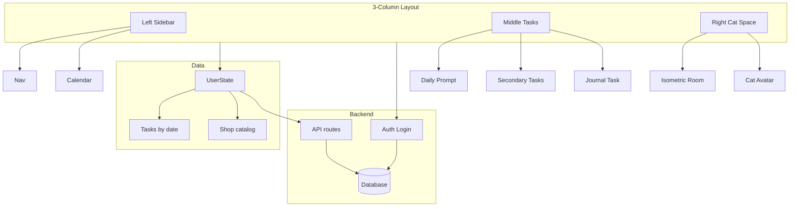

# Cat-Companion Productivity App — Full Plan

## Stack and repo

- **Next.js (App Router) + TypeScript**
- **Styling:** CSS Modules or Tailwind (calm, minimal task UI; cozy cat space)
- **Auth:** Login so data is per-user. Recommended: **NextAuth.js** (email/password or OAuth) or **Supabase Auth** (if using Supabase for DB). Protect app routes; show login screen when unauthenticated.
- **Database:** Persist user data so cat room, points, and inventory stay the same across devices/sessions. Options: **Supabase (Postgres + auth)** or **Vercel Postgres + NextAuth**. Tables: user profile (or use auth provider), user_state (points, streak, onboarding flag), room_layout (placed items), completed_tasks (or task_completions), owned_items.
- **State:** React state + context (or Zustand) for client state; **sync to database** when logged in (load on mount, save on changes). Optional: keep localStorage as cache or for offline draft; prefer DB as source of truth.
- **Cat:** Static image(s) + image swap for reactions; optional light CSS motion. No sprite animation for MVP.

---

## High-level architecture

---

## 1. Project setup

- Create Next.js app with TypeScript, App Router, and chosen CSS approach.
- Add a single app layout with the 3-column structure (sidebar left, tasks center, cat space right). Use CSS Grid or flex; make responsive later (e.g. collapse sidebar or stack on small screens if needed).
- Define **types** for: `Task`, `UserState`, `ShopItem`, `RoomLayoutItem` (align with spec and [isometric plan](docs/isometric-cat-space.md)).

---

## 2. Left sidebar

- **Nav:** Links or buttons for "Today", "Shop", "Cat space" (or similar). One primary "home" view that shows tasks + cat space together.
- **Calendar:** Simple day picker (e.g. list of dates or a small calendar). Selected date drives which day's tasks are shown in the middle panel. Default to today.

---

## 3. Middle panel — Task system

- **Data:** Tasks are keyed by date. For MVP, use **seed/mock data** per date (e.g. one Daily Prompt, 2–3 content tasks, one journal task). Structure:
  - `id`, `type: 'daily_prompt' | 'content' | 'document'`, `title`, `pointValue`, `completedAt: number | null`
- **Daily Prompt:** One highlighted task at top; higher point value; prominent styling (Notion-like, calm).
- **Content tasks:** Checkbox or "Done" button; marking complete sets `completedAt` and awards points.
- **Document/Journal task:** Opens an editor (textarea or simple rich block). "Complete" on save/submit; then set `completedAt` and award points.
- **Completion flow:** On complete → add points to `UserState.points`, append to `completedTasks` (or mark task completed in day's list), trigger cat reaction (e.g. set `catReaction: 'happy'` for 1–2s then clear). No popup; optional small toast like "+N points".

---

## 4. Points and shop

- **Economy:** Each task has fixed `pointValue`. On completion, add to `UserState.points`. No streak/optional bonuses in MVP.
- **Shop:** Single page or panel listing items from a **catalog** (JSON or constant). Fields: `itemId`, `name`, `category`, `price`, `placementRules` (floor/wall), optional `rarity`.
- **Categories (MVP):** Furniture, Decorations, Cat Cosmetics, Room Themes (can start with one category to ship faster).
- **Purchase:** "Buy" deducts points, adds `itemId` to `UserState.ownedItems`. Disable button if `points < price`. No undo in MVP.
- **Inventory:** List of owned items; in **edit mode** of cat space, this becomes the source for drag-to-place (see cat space section).

---

## 5. Right panel — Cat space (isometric)

- Follow the [Isometric Cat Space Plan](docs/isometric-cat-space.md): CSS isometric wrapper, floor grid, two walls, placed items, cat avatar.
- **View mode (default):** No grid; cat and decorations visible; minimal overlay.
- **Edit mode (toggle):** Grid overlay, inventory of owned items, drag to floor/wall, rotate 90° steps, confirm/cancel. Staging state `pendingLayout`; confirm writes to `UserState.roomLayout` and persists.
- **Cat:** One or two static images (e.g. idle, happy). On `taskCompleted` / `itemPlaced` set reaction state; show "happy" image briefly then back to idle. Optional: subtle CSS animation (scale/translate) for reaction.
- **Persistence:** `roomLayout` in `UserState`; when logged in, persist via API to database so the cat room stays the same everywhere.

---

## 6. Auth and database

- **Login:** Users must sign in to use the app (or show a login/signup screen before main app). After login, all progress is tied to their account.
- **Auth provider:** NextAuth.js with credentials (email/password) and/or OAuth (Google, GitHub). Alternatively Supabase Auth; then use Supabase client for both auth and DB.
- **Database schema (per user):**
  - **users** (or rely on auth provider): `id`, `email`, etc.
  - **user_state:** `userId`, `points`, `streakCount`, `hasCompletedOnboarding`, `updatedAt`. One row per user.
  - **room_layout:** `userId`, `itemId`, `positionX`, `positionY`, `wallAnchorId` (nullable), `rotation`, `layer`, `sortOrder` (optional). Multiple rows per user.
  - **owned_items:** `userId`, `itemId`, `purchasedAt`. Multiple rows per user.
  - **task_completions:** `userId`, `taskId`, `date`, `completedAt`. One row per completion for history/streaks.
- **API routes:** e.g. `GET/PATCH /api/user/state`, `GET/PUT /api/user/room`, `GET/POST /api/user/owned-items`, `GET/POST /api/user/completions`. All scoped to the authenticated user (session).
- **Flow:** On app load, if logged in → fetch user state, room layout, owned items from API and hydrate client state. On any change (complete task, buy item, place item, confirm layout) → update local state and call API to persist. Cat room, points, and inventory then stay the same across devices and sessions.

---

## 7. Data model (client + DB)

- **UserState (client; mirrors DB):**
  - `points: number`
  - `completedTasks` or completion map (taskId + date)
  - `ownedItems: string[]` (itemIds)
  - `roomLayout: RoomLayoutItem[]`
  - `streakCount: number`
  - `hasCompletedOnboarding: boolean`
- **RoomLayoutItem:** `itemId`, `position: { x, y }` or `{ wallAnchorId }`, `rotation: 0|90|180|270`, `layer: 'floor'|'wall'`
- **Tasks:** Per-date task definitions (mock or from DB). Completions stored in DB as above.
- **Sync:** Load user state from API when session exists; save to API on mutations. Optionally debounce or batch updates (e.g. room layout on "Confirm").

---

## 8. Onboarding (first session)

- **Detect first run:** e.g. no `UserState` or flag `hasCompletedOnboarding`.
- **Flow:**
  1. Short message: "Complete tasks to earn points for your cat's home."
  2. Show one **starter task** (e.g. "Say hi to your cat") that auto-completes or has a single tap — guaranteed success.
  3. Award points and trigger cat reaction.
  4. Open shop with one **cheap starter item** (or highlight it).
  5. After purchase, prompt to "Decorate your space" and switch to cat space **edit mode**; guide user to place the item and confirm.
- Set `hasCompletedOnboarding: true` so this flow does not show again.

---

## 9. MVP checklist (definition of done)

- Login/signup; app requires auth to use (cat room, points, tasks).
- Daily tasks list loads for the selected date (sidebar calendar).
- Completing a task (any type) awards points and shows success state; cat reacts (image swap or CSS); completion is saved to DB.
- Shop lists items and supports purchasing with points; owned items saved to DB and appear in inventory.
- Cat space has view mode and edit mode; in edit mode, drag/place/rotate/remove with confirm/cancel; room layout persists in DB (same across devices/sessions).
- Points and user state persist in database for logged-in user.
- Onboarding: user completes a starter task, gets points, buys a cheap item, places it in the room once; onboarding flag stored in DB.

---

## 10. Suggested folder structure

- `app/` — layout (with auth check), page(s), `api/` routes (user state, room, owned-items, completions), `auth/` for NextAuth or auth callback if using Supabase.
- `components/` — `layout/` (Sidebar, Calendar), `tasks/`, `shop/`, `cat-space/` (as in isometric plan), `auth/` (LoginForm, signup if applicable).
- `lib/` — `isometric.ts`, `tasks.ts`, `shop-catalog.ts`, `db.ts` or Supabase client, `auth.ts` (NextAuth config or auth helpers).
- `types/` — `task.ts`, `user.ts`, `shop.ts`, `room.ts`.
- `context/` or `store/` — app state (user session, user data from API, selected date, cat reaction, edit mode).

---

## 11. Non-goals (MVP)

- No leaderboards or social features.
- No heavy notifications.
- No crafting or multi-room editor.
- No sprite-based cat animation (static/image swap + optional CSS only).
