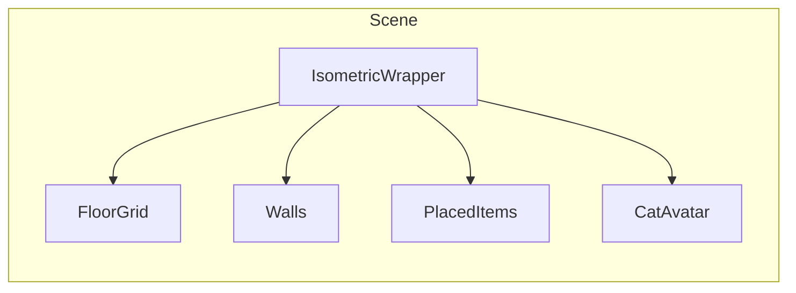

# Isometric 2.5D Cat Space — Implementation Plan

## Recommended approach: **CSS isometric + DOM**

Use **CSS 3D transforms** to create the isometric view, with **DOM elements** for the room, floor, walls, cat, and placed items. This fits Next.js/React well: each tile and item is a component, drag/drop and edit-mode UI stay simple, and you avoid a separate game engine.

---

## 1. Isometric projection (CSS)

- **Container:** A wrapper with fixed aspect and overflow hidden. Apply a single transform to get the isometric look:
  - `transform: rotateX(55deg) rotateZ(-45deg)` (or `rotateY(45deg) rotateX(30deg)` depending on the exact "2.5D" look you want).
- **Child content** (floor, walls, sprites) lives in a **logical 2D grid** (e.g. `gridCols × gridRows`). Each cell is a div (or component) positioned with `transform: translate(x, y)` so that when the parent's 3D transform is applied, they form an isometric grid.
- **Coordinate system:** Use **grid coordinates** `(col, row)` in logic. Convert to screen position with a small util:
  - `gridToScreen(col, row) → { x, y }` using the same isometric math (e.g. `x = (col - row) * tileWidth/2`, `y = (col + row) * tileHeight/2`). Use these values for `transform: translate(x, y)` so all positioning is driven from grid coords.

This gives you a fixed camera, one consistent angle, and no WebGL/Canvas for MVP.

---

## 2. Room structure (single room, MVP)

- **Floor:** One component that renders a grid of "tiles" (e.g. 8×8 or 10×10). Each tile is a div; in **view mode** they can be invisible or subtle; in **edit mode** show a grid overlay (borders or semi-transparent cells).
- **Walls:** Two planes (e.g. "back" and "side") as divs with background images or CSS gradients. They sit behind the floor in z-order. Optionally define **wall anchor points** (e.g. indices or IDs) for wall-item placement.
- **Layering (z-index / stacking):** Use a **painter's algorithm**: render in order (e.g. back wall → floor → floor items → cat → front wall). In CSS, assign `z-index` or use a single stacking context and DOM order. For correct overlap (e.g. cat in front of some tiles), derive a per-item "depth" from grid position (e.g. `col + row`) and set `z-index` or order accordingly.

---

## 3. View mode vs edit mode

- **View mode (default):**
  - No grid overlay; floor tiles can be invisible or very subtle.
  - Cat and placed items are visible; minimal UI overlay.
  - Click handlers on items can trigger small interactions (optional).
- **Edit mode (explicit toggle):**
  - Same isometric scene, but:
    - Show grid overlay on the floor (e.g. borders or highlights on each tile).
    - Show an **inventory panel** (owned items not yet placed, or "remove" for already-placed).
  - **Placement:** Drag from inventory → drop on floor tile or wall anchor. On drop, convert pixel position to grid `(col, row)` or wall anchor id using the inverse of your grid math.
  - **Rotation:** For placed items, store `rotation: 0 | 90 | 180 | 270`. Apply as CSS `transform: rotate(...)` (in addition to position). In edit mode, show a "rotate" control (e.g. button or key) that cycles through the four values.
  - **Confirm / Cancel:** Edit mode keeps a **staging state** (e.g. `pendingLayout`). "Confirm" commits to `roomLayout` (persisted); "Cancel" discards and restores previous `roomLayout`.

---

## 4. Placement rules (MVP)

- **Floor:** One item per grid cell. When dropping, snap to tile center using `gridToScreen(col, row)` and check that `(col, row)` is not occupied in current (or pending) layout.
- **Walls:** Separate array or structure for wall items; each entry has `wallAnchorId` (or index). One item per anchor; same snap/validation idea.
- **Collision:** Before adding to `pendingLayout`, check occupancy. If occupied, show simple "Cannot place here" feedback (e.g. brief message or red outline) and do not add.
- **Rotation:** Persist as 0/90/180/270; apply in CSS so the asset rotates correctly (and hit-box for interaction stays aligned if you add it later).

---

## 5. Cat avatar and reactions

- **Asset:** Single cat sprite (or a few frames). Position in the room using grid coords (e.g. fixed tile or "walkable" area); render as a DOM element or small canvas/SVG so it respects the same isometric transform.
- **Idle:** CSS animation (e.g. subtle bounce, tail sway) or a few sprite frames on a timer. Keep it short and loopable.
- **Reactions:** Map events to animation names or sprite states:
  - `taskCompleted` → short "happy" (e.g. tail flick, small hop, or "purr" frame).
  - `multipleTasksCompleted` → slightly longer (e.g. spin or stretch).
  - `itemPlaced` → curiosity (e.g. look or step toward).
- **Non-blocking:** Trigger animation via state (e.g. `catReaction: 'happy'`); no modal or full-screen overlay. Timeout after 1–2s to clear and return to idle.

---

## 6. Data and persistence

- **Room layout:** Array of `RoomLayoutItem`: `{ itemId, position: { x, y } | { wallAnchorId }, rotation, layer: 'floor' | 'wall' }`. Store in your app state and persist (e.g. localStorage or API) so layout survives refresh.
- **Rendering:** In the isometric view, map `roomLayout` to React components: each item looks up `itemId` in the shop/catalog for image and `placementRules`, then renders at the correct grid (or wall) position with the correct rotation.

---

## 7. When to consider Canvas / PixiJS later

- Stick with **CSS + DOM** for MVP: faster to ship, easier to wire to React state and Next.js.
- Consider **Canvas or PixiJS** later if you need: many animated sprites, particles, smooth 60fps character movement, or multiple rooms with scrolling. Then you'd keep the same **grid coordinate model** and **placement rules**, and only change the **rendering layer** from DOM to canvas.

---

## 8. Suggested file/component layout (Next.js)

- `components/cat-space/IsometricRoom.tsx` — wrapper with CSS transform; owns view vs edit mode.
- `components/cat-space/FloorGrid.tsx` — grid of tiles; shows overlay in edit mode.
- `components/cat-space/Walls.tsx` — back/side wall planes.
- `components/cat-space/PlacedItem.tsx` — one item at grid/wall position + rotation.
- `components/cat-space/CatAvatar.tsx` — cat sprite + idle/reaction state.
- `lib/isometric.ts` — `gridToScreen`, `screenToGrid`, constants (tile size, grid size).
- `components/cat-space/EditModeInventory.tsx` — list of owned items to drag from (edit mode only).

This keeps the isometric cat space contained, testable, and ready to plug into the rest of the app (tasks, points, shop) as in your full product spec.
